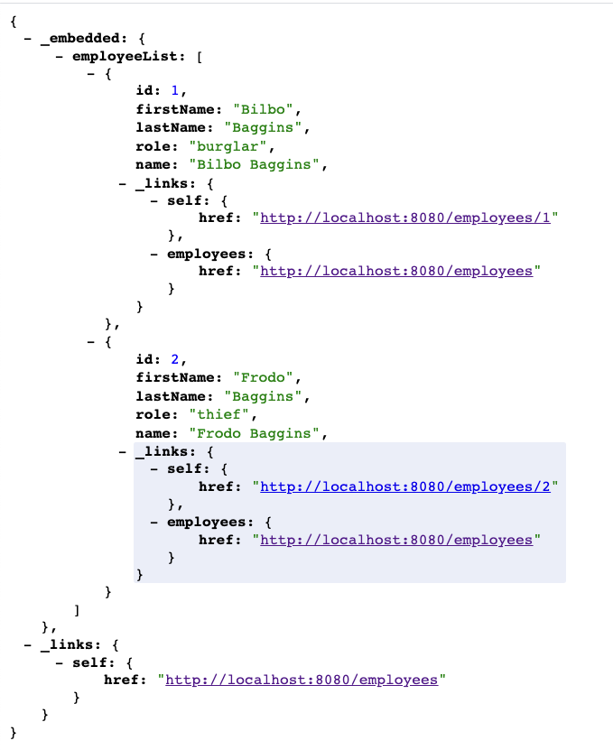

# Simple HTTP APP with Spring Boot

### Getting Started :rocket:

You can run the app using:

`mvn clean spring-boot:run`

And go to [localhost:8080/employees](http://localhost:8080/employees) to check the Web Service Works. You should see the following employees list:

# Requirements:

You need [Maven](https://maven.apache.org/install.html) installed in order to run the App.

---
### TODO

Try to understand the code in the [payroll](src/main/java/payroll) folder and extend it so the following is achieved:

In the [Employee](src/main/java/payroll/Employee.java) file:
1. Add a new property `salary` to the employee class 
2. Add the property to the initial data in [LoadDatabase](src/main/java/payroll/LoadDatabase.java)

Check that the list at [localhost:8080/employees](http://localhost:8080/employees) should look like this:

### Solution

You can find the solution in the brach salary:

`git checkout salary`

---

### Made with :orange_heart: in Berlin by @CodeWithDragos